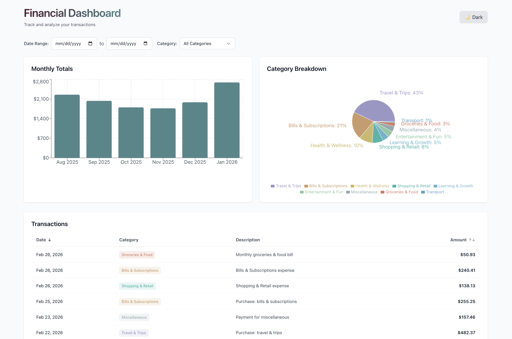
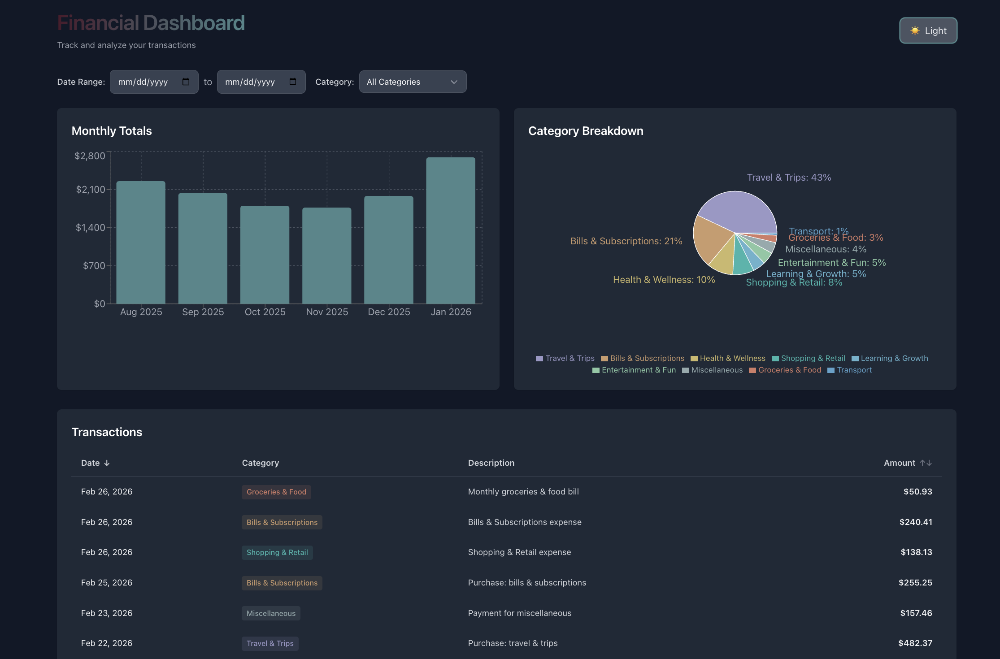

# React: Fintech-Style Dashboard

## Environment

- **React Version:** 18.2.0
- **Node Version:** ^18.x (or ^20.x recommended)
- **Frontend (Vite) default port:** 5173
- **Backend (Express) default port:** 3001

🔗 **Live Demo:**  
[Click here to view the deployed app](https://fintech-dashboard-theta.vercel.app/)

_The API runs on Render’s free tier and may take 30–60 seconds to respond after idle; the page will load once it’s awake._

## Project Specifications

**Fintech-style dashboard**. Charts for monthly totals and categories, filters by date and category, and a sortable table so you can browse transactions. Built as a portfolio project.

### 💡 Light Mode



### 🌙 Dark Mode



The app lets users:

- View **monthly totals** in a bar chart
- View **category breakdown** in a pie chart
- Filter by **date range** and **category**
- Browse **transactions** in a sortable, paginated table
- Toggle **dark mode**

The frontend is built with **React**, **TypeScript**, **Vite**, **Tailwind CSS**, and **Recharts**. The backend is a simple **Express** API serving mock data.

### Tech stack

| Layer    | Stack                                                        |
| -------- | ------------------------------------------------------------ |
| Frontend | React 18, TypeScript, Vite, Tailwind CSS, Recharts, date-fns |
| Backend  | Node.js, Express, TypeScript (tsx)                           |

### API base URL

The frontend talks to the backend at:

- **Default:** `http://localhost:3001`
- Override with env: `VITE_API_URL` (e.g. your deployed API URL)

### Main API endpoints

| Endpoint                                                                                   | Description                                  |
| ------------------------------------------------------------------------------------------ | -------------------------------------------- |
| `GET /api/transactions/monthly-totals`                                                     | Monthly aggregated totals                    |
| `GET /api/transactions/category-breakdown?startDate=&endDate=`                             | Category breakdown for a date range          |
| `GET /api/transactions?page=&pageSize=&startDate=&endDate=&categoryId=&sortBy=&sortOrder=` | Paginated, filterable, sortable transactions |
| `GET /api/categories`                                                                      | List categories                              |
| `GET /health`                                                                              | Health check                                 |

### How to run locally

**Backend**

```bash
cd backend
npm install
npm run dev
```

**Frontend**

```bash
cd frontend
npm install
npm run dev
```

Then open [http://localhost:5173](http://localhost:5173). Ensure the backend is running on port 3001 so the dashboard can load data.

### Build for production

**Backend**

```bash
cd backend
npm run build
npm start
```

**Frontend**

```bash
cd frontend
npm run build
npm run preview
```

Use your preferred hosting (e.g. Vercel for frontend, Railway/Render for backend) and set `VITE_API_URL` in the frontend to your deployed API URL.
